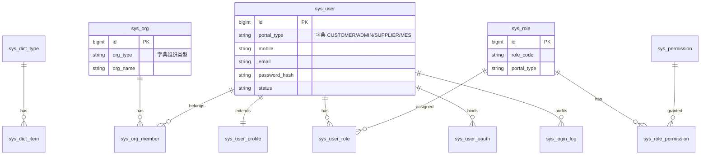

# AgileMake 数据库设计总览

> 库名：`agilemake_sql`（PostgreSQL）  
> 依据：功能结构图 + 四端登录/注册页（客户 / 管理员 / 供应商 / MES）  
> **调整入口**：字段与策略未定稿前，请先改 [`REQ_数据库需求表.md`](./REQ_数据库需求表.md)；**需求捋清并确认前，不建库、不写业务代码**。确认后再同步 SQL、再搭后端。  
> 原则：先定域与表边界；现有 `01/02` SQL 仅为对照草案，可忽略不执行。

---

## 1. 设计原则

| 原则 | 说明 |
|------|------|
| 统一账号 | 四端共用一张账号主表，用「门户类型」区分入口，避免四套登录表分裂 |
| 字典驱动 | 状态、门户类型、角色细分、行业等枚举进字典表，业务表只存 `dict_code` / 绑定 ID |
| 角色可细分 | 大类（客户/管理/供应/MES）稳定；细分类（采购、报价员、车间主任…）走角色 + 字典扩展 |
| 组织解耦 | 公司/工厂/管理组织独立成组织表，账号通过成员关系挂靠 |
| 软删除 + 审计 | 关键业务表统一 `is_deleted` / `created_at` / `updated_at` |
| 分域前缀 | `sys_` 系统基础，`auth_` 鉴权扩展；后续域见下表 |

---

## 2. 整体域框架（按产品功能结构）

```text
agilemake_sql
├── 01 sys_   系统基础（字典 / 配置 / 文件 / 操作日志）     ← 本期部分落地
├── 02 auth_  账号鉴权（用户 / 组织 / 角色权限 / 登录）     ← 本期完整落地
├── 03 quote_ 智能报价 / RFQ / DFM / 报价单
├── 04 order_ 订单与履约 / 物流 / 售后
├── 05 model_ 模型库 / 社区 / 创作者 / 版本
├── 06 scan_  扫描服务 / 设备 / 扫描订单
├── 07 mes_   车间生产 / 工序 / 质检 / Agent
├── 08 spl_   供应商能力 / 合作 / 分配
├── 09 cs_    客服中心 / 会话 / 分配 / 评价
├── 10 mbr_   会员 / 积分 / 任务 / 成长
├── 11 ai_    AI 调用 / Token / Prompt / RAG
├── 12 cms_   营销页 / 资源中心 / SEO 内容
└── 13 fin_   财务 / 充值 / 结算 / 优惠券
```

后续每个域单独 `0x_xxx.sql`，不要堆在一个文件里。

---

## 3. 使用者模型（本期重点）

### 3.1 四端门户（大类，字典固定）

| dict_code | 含义 | 注册入口主要字段 |
|-----------|------|------------------|
| `CUSTOMER` | 客户（用户） | 公司名称、联系人、职位/部门、手机、邮箱、密码 |
| `ADMIN` | 管理员 | 管理组织、超级管理员姓名、手机、邮箱、密码 |
| `SUPPLIER` | 供应商 | 供应商名称、对接人、手机、邮箱、密码 |
| `MES` | MES 生产人员 | 工厂/组织名称、系统负责人、手机、邮箱、密码 |

### 3.2 客户：个人最小单位 + 企业开通授权

```text
注册 → CUSTOMER_PERSONAL（个人）
         ├─ 可购个人版套餐（绑 USER）
         └─ 创建/加入企业
              └─ 企业订购（绑 ORG）→ 授权到成员个人使用

报价：由平台侧完成（谈客→算价→抛 RFQ），不设客户「工程师报价」或供应商「报价员」角色。
```

角色明细见 `REQ_数据库需求表.md` **C0 / C3**（v0.3）。

### 3.3 本期表清单

| 表名 | 用途 |
|------|------|
| `sys_dict_type` | 字典类型 |
| `sys_dict_item` | 字典项 |
| `sys_org` | 组织（客户公司 / 供应商标的 / 工厂 / 管理组织） |
| `sys_user` | 统一账号（登录主体） |
| `sys_user_profile` | 账号资料扩展（职位、头像等） |
| `sys_org_member` | 账号 ↔ 组织 |
| `sys_role` | 角色（可细分） |
| `sys_permission` | 权限资源 |
| `sys_user_role` | 账号 ↔ 角色 |
| `sys_role_permission` | 角色 ↔ 权限 |
| `sys_user_oauth` | 第三方登录绑定 |
| `sys_login_log` | 登录日志 |

短信验证码建议放 Redis；若需审计可另加 `sys_sms_log`（本期不做）。

### 3.4 用户域关系（ER）



---

## 4. 执行顺序

```bash
# 在 PostgreSQL 中已建库 agilemake_sql 的前提下：
psql -U postgres -d agilemake_sql -f 01_sys_dict.sql
psql -U postgres -d agilemake_sql -f 02_auth_user.sql
```

Windows（psql 在 PATH 中）示例：

```powershell
psql -U postgres -d agilemake_sql -f "D:\zhizao\zhizao\agilemake_sql\01_sys_dict.sql"
psql -U postgres -d agilemake_sql -f "D:\zhizao\zhizao\agilemake_sql\02_auth_user.sql"
```

---

## 5. 与后端约定

- 数据源已配置：`jdbc:postgresql://localhost:5432/agilemake_sql`
- 实体包建议：`com.agilemake.agilmakesystem.entity`
- 密码字段存 BCrypt/Argon2 哈希，禁止明文
- 登录标识：手机号优先，邮箱可选；`username` 可作历史兼容
- JWT / Session 细节在应用层，不进表结构（可选后续 `sys_refresh_token`）
